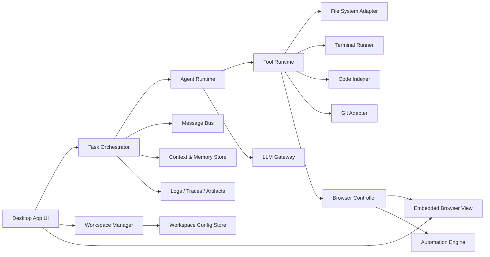
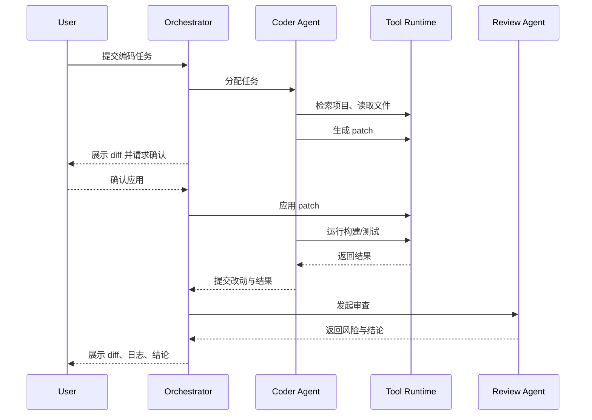
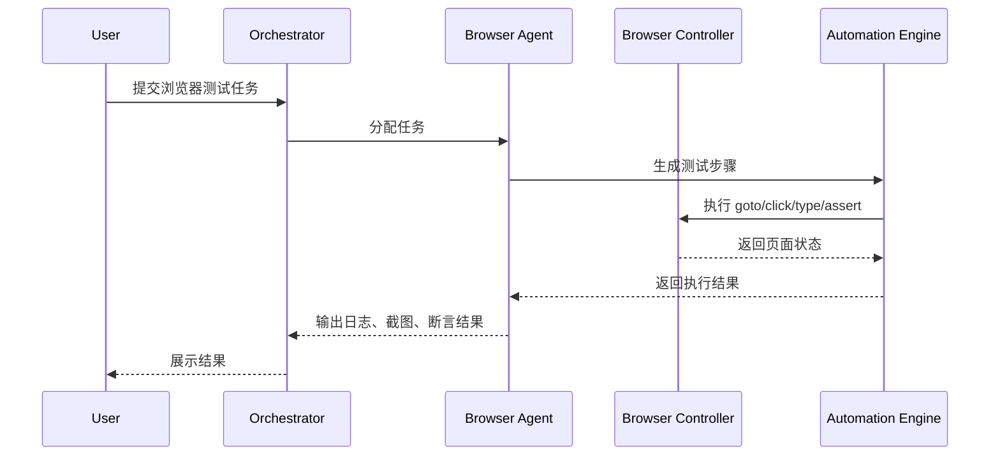
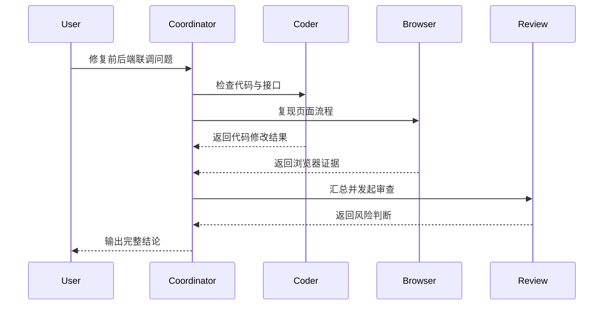

# Agent IDE 系统架构设计与模块拆分清单

## 1. 文档目标

本文档用于定义 Agent IDE 第一版的系统架构、核心模块边界、模块职责、推荐技术方案、数据模型和开发拆分清单，为正式研发提供实现蓝图。

## 2. 架构目标

系统需要同时满足以下要求：

- 支持本地多项目开发
- 支持多 Agent 协作
- 支持内嵌浏览器自动化
- 支持代码修改、命令执行与结果回传
- 支持前后端项目联动
- 支持可追踪、可回放、可审计

## 3. 总体架构

建议采用“桌面端 + 本地运行时服务 + LLM 网关 + 浏览器自动化引擎”的分层架构。

## 4. 分层设计

### 4.1 表现层

负责提供桌面 UI 及交互能力。

主要职责：

- 工作区与项目管理界面
- 对话与任务面板
- 浏览器面板
- 文件 diff 面板
- 日志与截图面板
- Agent 状态展示

建议技术：

- 桌面容器：Electron 优先，Tauri 可作为备选
- 前端框架：React
- 状态管理：Zustand 或 Redux Toolkit
- 编辑器：Monaco Editor

### 4.2 编排层

负责管理任务、会话、Agent 调度和执行流程。

主要职责：

- 接收用户任务
- 创建会话与任务树
- 选择 Agent
- 分发子任务
- 聚合结果
- 处理失败重试

建议技术：

- Node.js / TypeScript
- 事件驱动任务编排
- 队列模型使用内存队列起步，后续可切 Redis

### 4.3 Agent 运行层

负责承载多个 Agent 的运行逻辑。

主要职责：

- 维护 Agent 角色和能力列表
- 管理上下文窗口
- 生成工具调用计划
- 产出结构化结果

### 4.4 工具运行层

负责承接 Agent 的实际动作执行。

主要职责：

- 文件读写
- 终端命令执行
- 代码索引与搜索
- Git 操作
- 浏览器控制

### 4.5 浏览器自动化层

负责页面打开、交互、断言、日志与截图。

建议技术：

- Playwright 优先
- 通过 Browser Controller 对 UI 层的内嵌 WebView 进行统一桥接

### 4.6 存储与观察层

负责持久化任务、配置、日志和产物。

主要职责：

- Workspace 配置存储
- 任务与会话记录
- 浏览器截图与回放产物
- 命令执行日志
- Agent 消息记录

建议技术：

- SQLite 存储结构化数据
- 本地文件系统存放截图、日志、录屏、diff 快照

## 5. 核心模块拆分

## 5.1 Desktop App UI

职责：

- 展示主界面
- 承载浏览器、对话、日志、diff、项目管理面板
- 发起用户操作
- 实时更新任务状态

子模块：

- `WorkspacePanel`
- `ProjectPanel`
- `ChatPanel`
- `TaskPanel`
- `AgentStatusPanel`
- `DiffViewerPanel`
- `BrowserPanel`
- `LogsPanel`

## 5.2 Workspace Manager

职责：

- 创建和维护 Workspace
- 注册多个项目
- 保存项目元数据
- 保存项目关联关系

输入：

- 用户添加项目目录
- 用户配置项目类型与命令

输出：

- 工作区配置
- 项目配置
- 前后端绑定关系
- 环境配置视图

## 5.3 Project Runtime Manager

职责：

- 启动项目
- 停止项目
- 监测端口
- 检测健康状态
- 保存运行实例信息

能力点：

- 支持多个项目同时运行
- 支持启动顺序
- 支持端口占用检测
- 支持失败重启策略
- 支持按环境配置启动

## 5.4 Task Orchestrator

职责：

- 创建任务树
- 调度 Agent
- 维护任务状态机
- 跟踪子任务
- 收敛执行结果

任务状态建议：

- `planned`
- `created`
- `queued`
- `running`
- `waiting_confirm`
- `blocked`
- `retrying`
- `failed`
- `cancelled`
- `completed`

补充说明：

- `planned` 用于规划模式完成但尚未进入执行
- `blocked` 用于等待外部条件、用户确认或依赖服务可用
- `retrying` 用于长任务恢复或自动重试过程

## 5.5 Agent Runtime

职责：

- 管理 Agent 生命周期
- 为不同角色加载不同提示模板与工具权限
- 维护 Agent 上下文
- 接收与发送 Agent 消息

角色定义：

- `CoordinatorAgent`
- `CoderAgent`
- `BrowserAgent`
- `ReviewAgent`

## 5.6 Message Bus

职责：

- Agent 之间消息传递
- 编排层与执行层事件广播
- 执行结果回流

消息类型：

- `task.assigned`
- `task.started`
- `task.progress`
- `task.result`
- `task.failed`
- `artifact.created`
- `agent.message`
- `approval.requested`
- `approval.resolved`
- `rollback.created`

## 5.7 Context & Memory Store

职责：

- 保存会话摘要
- 保存项目级上下文
- 保存任务中间结论
- 供 Agent 检索历史信息

建议分层：

- 实时上下文
- 压缩摘要上下文
- 会话级上下文
- Workspace 级上下文
- 项目级上下文
- 固定上下文（Pinned Context）

补充职责：

- 管理长会话的上下文压缩
- 管理可恢复任务的检查点摘要
- 为不同 Agent 提供按需裁剪后的上下文视图
- 记录压缩前后引用关系，确保可追溯

建议压缩结构：

- `goal`
- `completedSteps`
- `pendingSteps`
- `decisions`
- `failures`
- `artifacts`
- `openQuestions`

## 5.7.2 Memory Management Module

职责：

- 提供记忆条目查询、修正、固定和停用
- 管理记忆召回白名单与黑名单
- 记录记忆来源链路
- 向 UI 提供记忆管理面板所需数据

## 5.7.1 Run Mode Manager

职责：

- 管理 `Plan Mode`
- 管理 `Execute Mode`
- 管理 `Long Run Mode`
- 控制模式切换与权限边界
- 向 Task Orchestrator 提供当前模式约束

模式约束建议：

- `Plan Mode` 禁止副作用工具执行
- `Execute Mode` 允许按审批规则执行副作用
- `Long Run Mode` 允许后台持续执行、恢复和通知

## 5.8 Code Indexer

职责：

- 扫描项目结构
- 构建文件索引
- 支持文本检索
- 支持符号检索
- 支持引用定位

建议能力：

- 增量索引
- 忽略大目录和构建产物
- 语言适配插件化

## 5.9 File System Adapter

职责：

- 统一读写文件
- 生成 patch
- 对高风险写操作做保护

关键接口：

- `readFile`
- `writeFile`
- `applyPatch`
- `deleteFile`
- `listFiles`

## 5.10 Terminal Runner

职责：

- 执行 shell 命令
- 捕获 stdout/stderr
- 管理长时运行进程
- 绑定项目工作目录

关键能力：

- 超时控制
- 取消执行
- 环境变量注入
- 流式输出

## 5.11 Git Adapter

职责：

- 查询仓库状态
- 读取 diff
- 生成提交候选

第一版建议能力：

- `status`
- `diff`
- `rev-parse`
- `branch`
- `commit`
- `restore`

第一版可选能力：

- `checkout`
- `stash`

补充规则：

- `commit` 建议作为第一版正式能力，确保“修改 -> 验证 -> 固化结果”闭环成立
- `checkout` 和 `stash` 可后置，但必须预留接口
- 所有 Git 写操作都必须经过权限层和审计记录

## 5.11.1 Rollback & Recovery Manager

职责：

- 生成回滚点
- 基于 patch、Git 或检查点恢复任务
- 支持部分步骤重跑
- 向审批中心提供回滚风险摘要

## 5.12 Browser Panel + Browser Controller

职责：

- 提供页面展示
- 接收自动化控制命令
- 输出浏览器状态

关键能力：

- 导航
- 截图
- DOM 查询
- Console 监听
- Network 监听

技术路径补充：

- 第一版采用“内嵌浏览器展示层 + 独立 Playwright 自动化上下文”的模式
- 默认情况下，用户可见页面与自动化测试页面不是强制共享同一实例
- 如需共享登录态，应通过显式的会话同步机制传递 Cookie、LocalStorage 或存储态
- Browser Controller 负责统一抽象页面状态，避免上层直接依赖具体浏览器实现细节

## 5.13 Automation Engine

职责：

- 将自动化步骤转换为可执行浏览器动作
- 处理等待、断言、失败重试

建议抽象动作：

- `goto`
- `click`
- `type`
- `select`
- `upload`
- `waitFor`
- `assertText`
- `assertVisible`
- `screenshot`

## 5.14 Artifact Store

职责：

- 保存截图
- 保存日志
- 保存 diff 快照
- 保存浏览器回放结果
- 保存 patch 审批记录

目录建议：

- `artifacts/screenshots`
- `artifacts/logs`
- `artifacts/diffs`
- `artifacts/replays`

## 5.15 Observability Module

职责：

- 跟踪 Agent 执行链
- 跟踪工具调用
- 提供问题回放证据

建议记录：

- 时间戳
- Agent ID
- Task ID
- Tool Name
- 参数摘要
- 结果状态
- 耗时
- 权限确认结果
- 文件写租约冲突记录
- 运行模式切换记录
- 检查点创建和恢复记录
- 上下文压缩触发记录
- 模型路由和切换记录
- 环境切换记录
- 审批流转记录

## 5.16 Model Management Module

职责：

- 管理全局默认模型
- 管理 Agent 级模型覆盖
- 维护模型能力标签和路由策略
- 记录模型调用指标

建议能力：

- 默认模型策略
- 备用模型策略
- 按 Agent 角色路由
- 失败回退

## 5.17 Environment Config Center

职责：

- 管理 Workspace 环境集
- 管理项目级命令、端口、地址、健康检查
- 管理前后端绑定的环境映射
- 输出可直接用于项目启动的环境配置视图

## 5.18 Approval Center

职责：

- 汇总待审批操作
- 管理批准、拒绝、延后处理
- 按风险等级分组展示审批项
- 保留审批审计链路

## 6. 关键流程设计

### 6.1 编码任务流程

### 6.2 浏览器自动化流程

### 6.3 多 Agent 协作流程

## 7. 数据模型建议

## 7.1 Workspace

字段建议：

- `id`
- `name`
- `rootPath`
- `createdAt`
- `updatedAt`

## 7.2 Project

字段建议：

- `id`
- `workspaceId`
- `name`
- `type`
- `rootPath`
- `devCommand`
- `buildCommand`
- `testCommand`
- `port`
- `healthCheckUrl`

## 7.3 ProjectLink

字段建议：

- `id`
- `workspaceId`
- `frontendProjectId`
- `serviceProjectId`
- `serviceRole`
- `environmentName`
- `apiBaseUrl`
- `proxyPrefix`
- `startupOrder`
- `healthCheckUrl`
- `enabled`

补充说明：

- `serviceProjectId` 可指向后端服务、BFF、Mock 服务等任意被绑定服务
- 一个前端项目可对应多条 `ProjectLink` 记录

## 7.4 Agent

字段建议：

- `id`
- `role`
- `status`
- `capabilities`
- `toolPermissions`
- `modelProfileId`

## 7.5 Task

字段建议：

- `id`
- `workspaceId`
- `parentTaskId`
- `title`
- `type`
- `status`
- `runMode`
- `assignedAgentId`
- `inputPayload`
- `resultPayload`
- `checkpointRef`
- `createdAt`
- `updatedAt`

## 7.6 Session

字段建议：

- `id`
- `workspaceId`
- `userPrompt`
- `summary`
- `compressedSummary`
- `pinnedContext`
- `status`
- `memoryPolicy`

## 7.7 ToolCall

字段建议：

- `id`
- `taskId`
- `agentId`
- `toolName`
- `input`
- `outputSummary`
- `status`
- `durationMs`

## 7.8 Artifact

字段建议：

- `id`
- `taskId`
- `type`
- `path`
- `metadata`

建议新增实体：

## 7.9 ProjectRuntimeInstance

字段建议：

- `id`
- `projectId`
- `workspaceId`
- `pid`
- `port`
- `status`
- `startedAt`
- `stoppedAt`

## 7.10 BrowserSession

字段建议：

- `id`
- `taskId`
- `workspaceId`
- `mode`
- `storageStateRef`
- `status`

## 7.11 BrowserStep

字段建议：

- `id`
- `browserSessionId`
- `stepType`
- `payload`
- `status`
- `startedAt`
- `endedAt`

## 7.12 AgentMessage

字段建议：

- `id`
- `taskId`
- `fromAgentId`
- `toAgentId`
- `messageType`
- `summary`
- `artifactRefs`
- `createdAt`

## 7.13 PatchReview

字段建议：

- `id`
- `taskId`
- `agentId`
- `patchRef`
- `approvalStatus`
- `approvedBy`
- `approvedAt`

## 7.14 TaskCheckpoint

字段建议：

- `id`
- `taskId`
- `stageName`
- `summary`
- `artifactRefs`
- `restorableStateRef`
- `createdAt`

## 7.15 ContextSnapshot

字段建议：

- `id`
- `sessionId`
- `snapshotType`
- `summary`
- `sourceRange`
- `createdAt`

## 7.16 MemoryEntry

字段建议：

- `id`
- `scopeType`
- `scopeId`
- `topic`
- `summary`
- `artifactRefs`
- `sourceTaskId`
- `isPinned`
- `isDisabled`
- `createdAt`

## 7.17 ModelProfile

字段建议：

- `id`
- `scopeType`
- `scopeId`
- `provider`
- `modelName`
- `strategyTag`
- `fallbackModelName`
- `enabled`
- `createdAt`

## 7.18 EnvironmentProfile

字段建议：

- `id`
- `workspaceId`
- `projectId`
- `name`
- `devCommand`
- `buildCommand`
- `testCommand`
- `port`
- `baseUrl`
- `healthCheckUrl`
- `envRef`
- `enabled`

## 7.19 ApprovalRequest

字段建议：

- `id`
- `taskId`
- `requestType`
- `riskLevel`
- `summary`
- `payloadRef`
- `status`
- `requestedByAgentId`
- `resolvedBy`
- `resolvedAt`

## 7.20 RollbackPoint

字段建议：

- `id`
- `taskId`
- `rollbackType`
- `targetRef`
- `summary`
- `createdAt`

## 8. 模块间接口建议

## 8.1 UI -> Orchestrator

关键接口：

- `createTask`
- `cancelTask`
- `retryTask`
- `listTasks`
- `getTaskDetail`
- `approvePlan`
- `switchRunMode`
- `resumeLongTask`
- `listApprovals`
- `resolveApproval`
- `rollbackTask`
- `switchEnvironment`
- `updateModelProfile`

## 8.2 Orchestrator -> Agent Runtime

关键接口：

- `assignTask(agentRole, taskPayload)`
- `getAgentStatus(agentId)`
- `submitTaskResult(taskId, result)`
- `generatePlan(taskId, context)`
- `compressContext(sessionId)`
- `selectModel(agentRole, workspaceId)`
- `summarizeApprovalRisk(taskId, payload)`

## 8.3 Agent Runtime -> Tool Runtime

关键接口：

- `searchCode`
- `readFile`
- `applyPatch`
- `runCommand`
- `openBrowser`
- `runBrowserSteps`
- `saveCheckpoint`
- `restoreCheckpoint`
- `restorePatch`
- `restartFromStep`

## 8.4 Automation Engine -> Browser Controller

关键接口：

- `navigate(url)`
- `query(selector)`
- `perform(action)`
- `captureScreenshot()`
- `getConsoleLogs()`
- `getNetworkLogs()`
- `syncStorageState(sessionId)`
- `exportStorageState(sessionId)`

## 9. 权限与安全架构

必须内建权限层，不可后补。

### 9.1 权限等级

- `read-only`
- `workspace-write`
- `command-exec`
- `git-write`
- `browser-external-access`

补充维度：

- 权限需要同时支持全局、Workspace、Project、Agent 四层覆盖
- 每次授权应支持 `once`、`session`、`always` 三种授权时效

### 9.2 风险操作保护

以下操作建议强制确认：

- 删除文件
- 批量改写文件
- 安装依赖
- 执行高风险命令
- Git 提交与切换分支
- 导出或同步浏览器登录态

### 9.3 敏感信息保护

- 日志脱敏
- 环境变量白名单
- 命令黑名单
- 浏览器 Cookie 隔离

### 9.4 审批策略建议

- patch 写入默认进入审批
- 高风险命令默认进入审批
- Git 写操作默认进入审批
- 登录态同步默认进入审批
- 已授权的低风险操作可按策略自动放行

## 10. 推荐技术选型

## 10.1 前端与桌面

- `Electron + React + TypeScript + Monaco`

原因：

- 内嵌浏览器能力成熟
- Node 集成能力强
- 适合本地工具类产品

## 10.2 本地服务/编排层

- `Node.js + TypeScript`

原因：

- 方便与 Electron、Playwright、文件系统、终端能力整合

## 10.3 浏览器自动化

- `Playwright`

原因：

- API 成熟
- 支持日志、截图、选择器、断言
- 与桌面端 JS 技术栈配合好

## 10.4 存储

- `SQLite + Local File Storage`

原因：

- 本地产品部署简单
- 易于管理会话和任务数据

## 10.5 数据访问与配置

- `Drizzle ORM + better-sqlite3 + Zod`

原因：

- 适合本地 SQLite 场景
- 便于管理配置、审批、记忆、检查点等结构化数据
- 方便对环境配置和模型配置做 schema 校验

## 11. 开发模块拆分清单

建议按模块建目录并分工。

### A. 桌面端 UI

- 主布局
- 工作区面板
- 项目面板
- 任务与会话面板
- Agent 状态面板
- Diff 面板
- 浏览器面板
- 日志与产物面板
- 模型管理面板
- 环境配置面板
- 审批中心面板
- 记忆管理面板
- 回滚恢复面板

### B. 工作区与项目管理

- Workspace CRUD
- Project CRUD
- 项目类型识别
- 项目关联配置
- 启动配置管理
- 环境配置管理

### C. 任务编排系统

- Task 状态机
- 子任务树
- 调度器
- 重试与取消
- 执行历史
- 运行模式管理
- 长任务恢复
- 检查点管理

### D. Agent Runtime

- Agent 注册机制
- Coordinator Agent
- Coder Agent
- Browser Agent
- Review Agent
- 规划模式计划生成
- 上下文压缩器

### E. 工具层

- 文件系统适配器
- 终端执行器
- Git 适配器
- 代码索引器
- 浏览器控制器
- 回滚恢复执行器

### F. 浏览器自动化

- Browser 内嵌容器
- Playwright 驱动
- 自动化步骤执行器
- 日志与截图采集
- 回放结果存储

### G. 存储与可观察性

- SQLite 表结构
- 产物目录管理
- 日志归档
- Trace 展示
- 上下文快照
- 长任务检查点
- 记忆条目存储
- 模型配置存储
- 环境配置存储
- 审批记录存储
- 回滚点存储

### H. 安全与权限

- 权限配置
- 命令拦截
- 敏感信息脱敏
- 高风险确认

### I. 运行模式与记忆系统

- Plan Mode 控制
- Execute Mode 控制
- Long Run Mode 控制
- Context Compression
- Pinned Context
- 项目级记忆检索

### J. 平台治理能力

- 模型路由与配置
- 审批策略与审批队列
- 环境切换与环境映射
- 回滚与恢复策略

## 12. 第一阶段建表建议

建议至少建以下表：

- `workspaces`
- `projects`
- `project_links`
- `agents`
- `sessions`
- `tasks`
- `task_events`
- `tool_calls`
- `artifacts`
- `workspace_settings`
- `model_profiles`
- `environment_profiles`
- `approval_requests`
- `rollback_points`

## 13. 实施优先级

虽然第一版全部要做，但研发落地仍建议按依赖关系推进。

### P0 必须最先完成

- Desktop App 基础壳
- Workspace Manager
- Task Orchestrator
- Agent Runtime 基础框架
- File System Adapter
- Terminal Runner

### P1 编码闭环

- Code Indexer
- Coder Agent
- Diff Viewer
- Build/Test 执行链
- Review Agent

### P2 浏览器闭环

- Browser Panel
- Browser Controller
- Automation Engine
- Browser Agent
- 截图/日志采集

### P3 协作闭环

- Message Bus
- 子任务分发
- 联调模式
- 前后端项目绑定
- 全链路追踪

### P4 平台治理闭环

- Model Management Module
- Environment Config Center
- Approval Center
- Memory Management Module
- Rollback & Recovery Manager

## 14. 交付定义

达到以下标准，可认为第一版架构目标达成：

- 本地可创建并管理多项目 Workspace
- Agent 可完成代码理解、修改、验证
- 内嵌浏览器可执行自动化测试
- 前后端项目可完成绑定与联调
- 多 Agent 可进行任务协作
- 全链路日志、diff、截图、结果可追踪

## 15. 结论

该项目的关键不是“接一个大模型”，而是搭建一个完整的本地智能开发运行时。架构设计必须优先保证四件事：

1. 工具执行闭环
2. 浏览器自动化闭环
3. 多项目联调闭环
4. 多 Agent 协作闭环

只要这四个闭环打通，产品就具备了从“AI 助手”升级为“Agent IDE 平台”的基础。
