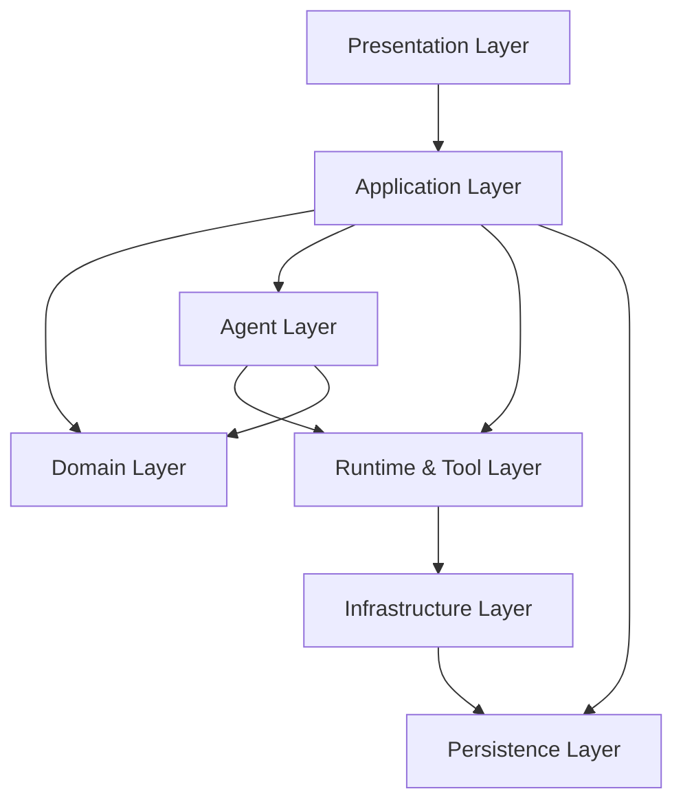

# Agent IDE Codex 风格分层规划

## 1. 文档目标

本文档不讨论具体编码实现，只用于固定第一版的分层方式、模块边界、调用方向和目录规划。

本项目产品形态可以参考 Codex App，但不是简单复制界面，而是参考它的三个核心特点：

- 一个统一桌面壳承载对话、任务、文件、日志、浏览器
- 本地运行时负责真正执行命令、改文件、跑浏览器、保存记录
- Agent 不是直接碰 UI，而是通过编排层和工具层完成工作

第一版数据库明确使用：

- `SQLite`

## 2. 总体原则

### 2.1 模仿 Codex 的部分

- 桌面端承载完整开发体验，而不是单纯聊天窗口
- 任务、文件改动、终端输出、浏览器结果在一个工作流里打通
- Agent 行为必须可追踪、可回放、可审计
- 工具调用由统一运行时接管，不让 UI 直接做危险动作

### 2.2 不直接照搬的部分

- 第一版不做云端复杂协同
- 第一版不做插件市场
- 第一版不做远程沙箱执行
- 第一版优先本地单机、多项目、多 Agent、浏览器自动化闭环

### 2.3 分层原则

- 上层只能依赖下层，不能反向跨层调用
- UI 不直接访问文件系统、终端、浏览器自动化引擎
- Agent 不直接操作 SQLite 和 UI
- 所有副作用操作必须经过 Application 层编排
- 所有落盘记录必须经过 Persistence 层
- 运行模式控制必须收口在 Application Layer
- 上下文压缩和记忆写入不能由 UI 或单个 Agent 自行决定

## 3. 推荐总分层

建议采用 7 层结构：

1. `Presentation Layer`
2. `Application Layer`
3. `Domain Layer`
4. `Agent Layer`
5. `Runtime & Tool Layer`
6. `Infrastructure Layer`
7. `Persistence Layer`

整体关系如下：



## 4. 各层职责定义

## 4.1 Presentation Layer

这一层对应桌面应用外壳，产品形态最接近 Codex App。

包含内容：

- 主窗口框架
- 左侧 Workspace / Project 导航
- 中间任务/对话区
- 右侧浏览器/日志/diff 面板
- 顶部会话、Agent、运行状态栏

只负责：

- 展示数据
- 接收用户操作
- 触发应用层用例
- 订阅任务和运行状态

绝对不负责：

- 直接改文件
- 直接执行命令
- 直接访问 SQLite
- 直接驱动浏览器自动化

推荐子模块：

- `shell`
- `workspace-ui`
- `chat-ui`
- `task-ui`
- `diff-ui`
- `browser-ui`
- `log-ui`

## 4.2 Application Layer

这是整个系统的“总控层”，也最关键。

职责：

- 接收 UI 请求
- 创建任务、会话、审批流
- 组装 Agent 执行上下文
- 调度 Runtime 工具
- 协调浏览器与项目运行
- 处理确认、失败、重试、回放
- 写入结构化记录

这一层可以理解为“本地 Orchestrator + Use Case 层”。

推荐模块：

- `workspace-service`
- `project-service`
- `task-service`
- `session-service`
- `agent-orchestration-service`
- `browser-test-service`
- `patch-review-service`
- `runtime-control-service`
- `permission-service`
- `run-mode-service`
- `checkpoint-service`
- `context-memory-service`
- `model-management-service`
- `environment-config-service`
- `approval-service`
- `rollback-recovery-service`

关键要求：

- 所有跨层操作必须先进入这一层
- 这一层是唯一允许同时调 Agent、Runtime、Persistence 的层
- 规划模式、执行模式、长任务模式都必须由这一层统一切换
- 上下文压缩、记忆提炼、恢复点生成都必须由这一层触发

## 4.3 Domain Layer

这是业务规则层，不依赖 Electron、Playwright、SQLite。

职责：

- 定义核心实体
- 定义状态机
- 定义业务约束
- 定义领域事件

核心实体建议：

- `Workspace`
- `Project`
- `ProjectLink`
- `Task`
- `Session`
- `Agent`
- `PatchReview`
- `BrowserSession`
- `RuntimeInstance`

核心规则建议放这里：

- 同一文件只能有一个写租约
- Patch 在审批前不能进入正式落盘状态
- Review Agent 可阻断高风险任务完成
- 前端项目可绑定多个服务项目
- 规划模式不得触发副作用
- 长任务必须具备可记录检查点的阶段边界
- 被固定的上下文不得被普通压缩清理
- 未审批的高风险操作不得进入执行态
- 环境切换必须在任务上下文中可追踪

## 4.4 Agent Layer

这一层专门承载多 Agent 逻辑，不与 UI 混杂。

职责：

- 维护 Agent 角色定义
- 维护 Agent 能力矩阵
- 组织 Prompt / 上下文
- 接收任务并生成工具调用计划
- 输出结构化结果摘要
- 生成规划模式下的任务计划
- 生成压缩摘要候选
- 根据角色适配模型策略

推荐 Agent：

- `CoordinatorAgent`
- `CoderAgent`
- `BrowserAgent`
- `ReviewAgent`

重要边界：

- Agent 不直接写数据库
- Agent 不直接操作 Electron 组件
- Agent 不能绕过 Runtime Tool 直接碰文件和终端
- Agent 不能自行切换长任务模式或直接提交检查点

## 4.5 Runtime & Tool Layer

这一层是真正执行动作的地方，相当于本地工具执行引擎。

职责：

- 文件读取和 patch 应用
- Shell 命令执行
- 项目启动/停止/监控
- Git 状态读取和提交
- 浏览器自动化动作执行
- 代码索引与检索

推荐模块：

- `file-runtime`
- `terminal-runtime`
- `project-runtime`
- `git-runtime`
- `browser-runtime`
- `index-runtime`
- `rollback-runtime`

这一层要保证：

- 工具接口统一
- 可审计
- 可中断
- 可超时
- 可返回结构化结果

## 4.6 Infrastructure Layer

这一层主要放技术细节适配器。

职责：

- Electron IPC 封装
- Playwright 适配
- Git 命令适配
- Shell/PTY 适配
- 文件系统适配
- LLM Provider 适配
- 日志和事件总线实现

注意：

- Infrastructure 负责“怎么接”
- Runtime 负责“怎么用”
- Application 负责“什么时候用”

## 4.7 Persistence Layer

这一层专门负责存储，第一版明确采用本地 `SQLite`。

职责：

- 表结构定义
- Repository 封装
- 事务管理
- 查询对象封装
- 数据迁移

建议 SQLite 保存：

- Workspace
- Project
- ProjectLink
- Task
- Session
- ToolCall
- Artifact
- AgentMessage
- BrowserSession
- BrowserStep
- PatchReview
- PermissionGrant
- TaskCheckpoint
- ContextSnapshot
- MemoryEntry
- ModelProfile
- EnvironmentProfile
- ApprovalRequest
- RollbackPoint

建议文件系统保存：

- 截图
- 日志原文
- diff 快照
- 回放产物
- 导出测试脚本

## 5. Codex 风格模块映射

为了更接近 Codex App 的体验，建议把功能映射成下面几块：

### 5.1 Shell 容器

作用：

- 提供整体窗口布局
- 承载多面板切换
- 统一状态栏

### 5.2 Conversation + Task 中枢

作用：

- 用户输入需求
- 展示 Agent 执行进度
- 展示审批请求
- 展示任务树
- 展示当前运行模式
- 展示长任务恢复入口
- 展示上下文压缩摘要

### 5.3 Workspace 中枢

作用：

- 管理多项目
- 配置前后端绑定
- 选择默认运行组合
- 切换当前环境

### 5.4 Browser 中枢

作用：

- 展示可见页面
- 显示自动化结果
- 选择是否同步登录态

### 5.5 Diff / Review 中枢

作用：

- 看 patch
- 审批改动
- 看 Review Agent 结论
- 发起回滚和恢复

### 5.6 Governance 中枢

作用：

- 管理模型策略
- 管理环境配置
- 管理审批队列
- 管理记忆条目
- 管理回滚点

### 5.7 Runtime 中枢

作用：

- 管命令
- 管进程
- 管端口
- 管健康检查

## 6. 推荐调用链路

## 6.1 用户发起编码任务

```text
UI -> Application(task-service)
   -> Agent Layer(CoderAgent)
   -> Runtime(file/index/terminal)
   -> Application(patch-review-service)
   -> Persistence(SQLite)
   -> UI
```

## 6.2 用户发起浏览器测试

```text
UI -> Application(browser-test-service)
   -> Agent Layer(BrowserAgent)
   -> Runtime(browser-runtime)
   -> Infrastructure(Playwright adapter)
   -> Persistence(SQLite + artifacts)
   -> UI
```

## 6.3 用户发起前后端联调

```text
UI -> Application(runtime-control-service)
   -> Runtime(project-runtime)
   -> Agent Layer(BrowserAgent / CoderAgent)
   -> Persistence
   -> UI
```

## 6.4 用户先规划再执行

```text
UI -> Application(run-mode-service)
   -> Agent Layer(CoordinatorAgent)
   -> Runtime(index-runtime/read-only)
   -> Application(task-service)
   -> Persistence(SQLite)
   -> UI
```

## 6.5 长任务恢复

```text
UI -> Application(checkpoint-service)
   -> Persistence(SQLite)
   -> Application(task-service)
   -> Agent Layer / Runtime Layer
   -> UI
```

## 6.6 上下文压缩与记忆提炼

```text
Application(context-memory-service)
   -> Agent Layer(summary/compression)
   -> Persistence(SQLite + artifacts refs)
   -> Application(task-service/session-service)
```

## 6.7 审批与回滚

```text
UI -> Application(approval-service)
   -> Persistence(SQLite)
   -> Application(rollback-recovery-service)
   -> Runtime(rollback-runtime/git-runtime/file-runtime)
   -> UI
```
```

## 7. SQLite 规划原则

虽然现在不展开表结构实现，但 SQLite 的定位要先固定：

### 7.1 SQLite 负责什么

- 结构化配置
- 结构化状态
- 审计记录
- 查询和筛选
- 历史任务回看

### 7.2 SQLite 不负责什么

- 大体积日志正文
- 截图二进制
- 浏览器录屏原文件
- 大 patch 原文长期堆积

这些建议只在 SQLite 存引用路径和摘要。

### 7.3 SQLite 使用建议

- 使用迁移脚本管理 schema
- 使用 Repository 隔离查询逻辑
- 所有重要状态变更写事件表
- 高并发写入场景采用串行化队列或轻量事务
- 上下文压缩结果、检查点和记忆条目必须独立建模，不与原始会话混写

## 8. 层间禁止事项

为避免后面代码越写越乱，下面这些必须提前禁止：

### 8.1 UI 禁止事项

- 直接 `fs.writeFile`
- 直接执行 shell
- 直接跑 Playwright
- 直接查 SQLite
- 直接修改模型、环境、审批、回滚底层记录

### 8.2 Agent 禁止事项

- 直接拼 SQL 落库
- 直接触碰 Electron 窗口
- 直接持有浏览器 UI 控件引用
- 直接覆盖压缩摘要或跳过审批链路

### 8.3 Runtime 禁止事项

- 自己决定业务流程
- 自己决定审批是否通过
- 自己改任务状态机定义
- 自己决定是否进入规划模式或长任务模式

### 8.4 Persistence 禁止事项

- 承担业务规则判断
- 调外部工具
- 直接依赖 UI

## 9. 推荐工程目录

如果后面正式搭框架，建议先按这个目录来：

```text
agent-ide/
  apps/
    desktop/
  packages/
    presentation/
    application/
    domain/
    agent-runtime/
    runtime-tools/
    infrastructure/
    persistence-sqlite/
    shared/
  artifacts/
  scripts/
  docs/
```

如果你更偏单仓工程，也可以进一步细分成：

```text
packages/presentation-shell
packages/presentation-workspace
packages/presentation-browser
packages/application-services
packages/domain-core
packages/agent-core
packages/runtime-file
packages/runtime-terminal
packages/runtime-browser
packages/infrastructure-electron
packages/infrastructure-playwright
packages/persistence-sqlite
```

## 10. 第一版最适合先定死的边界

在真正开工前，建议把下面 8 件事当成“不可再飘”的固定项：

1. `Electron + React` 作为桌面壳
2. `SQLite` 作为本地结构化存储
3. `Playwright` 作为浏览器自动化引擎
4. `Application Layer` 作为唯一总编排入口
5. `Agent Layer` 不直接碰 UI 和数据库
6. `Runtime Layer` 统一承接所有副作用操作
7. `Artifact 用文件系统，元数据用 SQLite`
8. `Patch 审批流和文件写租约作为默认规则`

再额外固定 3 件事：

9. `Plan Mode` 作为显式运行模式
10. `Long Run Mode` 作为后台任务标准模式
11. `Context Compression + Memory` 作为长会话基础能力
12. `Model Management` 作为 Agent 路由标准能力
13. `Environment Config Center` 作为联调入口
14. `Approval Center + Rollback` 作为风险控制底座

## 11. 结论

如果目标是做一个“像 Codex 一样能真正工作”的 Agent IDE，那么最重要的不是先堆功能，而是先把层次定对。

这一版最推荐的思路就是：

- 外面是 `Codex 风格桌面壳`
- 中间是 `Application 编排层`
- 里面是 `Agent + Runtime`
- 底下是 `Infrastructure + SQLite + Artifacts`

这样后面无论你继续加多 Agent、浏览器测试、前后端联调，还是做权限和审计，结构都不会塌。
